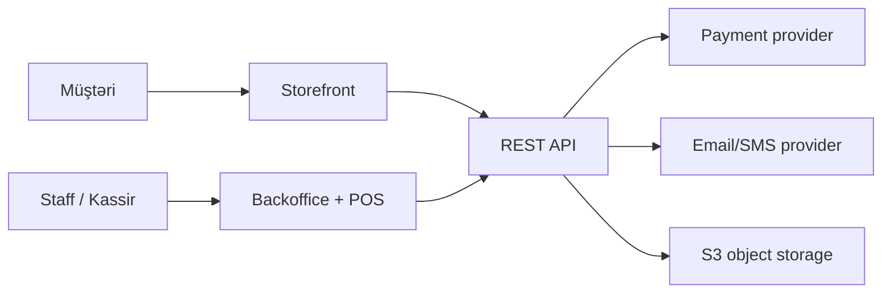
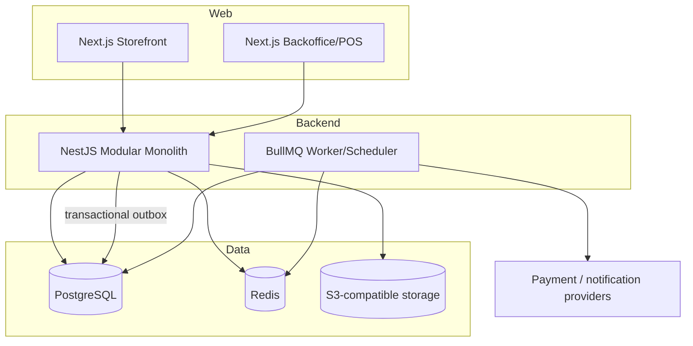

# Sistem arxitekturası

**Status:** Accepted for initial implementation  
**Son yenilənmə:** 2026-07-13  
**Əhatə:** ilkin production arxitekturası

## Məqsəd

ITMarket storefront, backoffice/POS və REST API-ni bir monorepo-da saxlayan, lakin deploy və təhlükəsizlik sərhədlərini ayıran commerce platformasıdır. Əsas prioritetlər maliyyə düzgünlüyü, stok bütövlüyü, audit edilə bilmə və mərhələli inkişafdır.

## Kontekst



Storefront və backoffice ayrı URL, deploy, cookie və auth audience istifadə edir. Hər iki tətbiq biznes əməliyyatlarını API üzərindən aparır; UI source of truth deyil.

## Konteyner görünüşü



API və worker eyni backend codebase-dən yaradıla bilər, amma ayrıca process kimi deploy edilməlidir. Worker dayansa HTTP trafiki işləyə bilər; async işlərin backlog-u monitorinq edilməlidir.

## Monorepo sərhədləri

```text
apps/storefront     Müştəri UI və storefront BFF ehtiyacları
apps/backoffice     Staff, admin və POS UI
apps/api            REST API, worker entrypoint və domain modulları
packages/contracts  OpenAPI-dən yaranan və ya ortaq stabil contract-lar
packages/ui         Yalnız həqiqətən ortaq, domainsiz UI primitive-ləri
packages/config     TypeScript, lint və build konfiqurasiyası
packages/testing    Test factory və infrastructure helper-ləri
infra/docker        Lokal və production container faylları
```

`packages/ui` storefront və backoffice-i vizual olaraq eyniləşdirməməlidir. Domain məntiqi `packages/contracts` və UI package-lərinə daşınmır.

## Backend modul xəritəsi

- **Identity:** `auth`, `staff`, `customers`
- **Merchandising:** `catalog`, `pricing`, `promotions`, `media`
- **Commerce:** `carts`, `orders`, `payments`
- **Availability:** `inventory`, `delivery`, `pickup`, `fulfillment`
- **Retail operations:** `pos`, `cash-register`
- **Platform:** `notifications`, `reports`, `audit`, `health`

Hər modul daxilində istiqamət belədir:

```text
controller -> application service -> domain -> port/interface
                                      |
                               infrastructure adapter
```

Qaydalar:

1. Controller yalnız transport, authentication context, input validation və response mapping edir.
2. Application service use-case transaction sərhədini və orchestration-u idarə edir.
3. Domain qatında framework-dən asılı olmayan invariant və state transition-lar yerləşir.
4. Infrastructure Prisma, Redis, queue, object storage və provider adapter-lərini reallaşdırır.
5. Modul başqa modulun cədvəlinə birbaşa yazmır. Dəyişiklik açıq application contract vasitəsilə edilir.
6. Cross-module DB transaction yalnız məlumat bütövlüyü tələb edəndə, dokumentləşdirilmiş service orchestration ilə istifadə olunur.

## Əsas data flow-lar

### Checkout

1. API səbəti, aktiv məhsulu, qiyməti və eligibility-ni serverdə yenidən yoxlayır.
2. Variant/location sətirləri transaction daxilində kilidlənir.
3. Order snapshot və stok reservation yaradılır.
4. COD uyğundursa order təsdiqlənir; online payment üçün payment attempt yaradılır.
5. Təkrarlanan request `Idempotency-Key` ilə eyni nəticəni qaytarır.
6. Notification və digər side effect-lər outbox-dan async işlənir.

### Payment callback

1. Raw body üzrə imza yoxlanır.
2. Provider event ID və biznes idempotency qaydası ilə duplicate event bloklanır.
3. Amount, currency və order əlaqəsi yoxlanır.
4. Payment state transaction daxilində dəyişir; uyğun order/stock nəticəsi tətbiq edilir.
5. Şübhəli uyğunsuzluq avtomatik `PAID` yaratmır və security event kimi qeydə alınır.

### POS satışı

1. Aktiv staff session, permission və açıq cash shift yoxlanır.
2. Barkoddan variant tapılır, qiymət serverdən hesablanır.
3. Sale, payment, inventory movement və receipt number bir transaction-da yaranır.
4. Client retry eyni idempotency key ilə ikinci satış yaratmır.
5. Çap edilmiş görünüş fiskal çek statusu demək deyil.

## Data ownership və source of truth

- Məhsul/variant metadata: catalog
- Satış qiymətinin hesablanması: pricing/promotions
- Fiziki və rezerv stok: inventory ledger
- Müştəri sifariş öhdəliyi: orders
- Provider və refund həqiqəti: payments
- Hazırlama/çatdırılma prosesi: fulfillment
- Kassa pulu və növbə: cash-register
- POS satış sənədi: pos
- Təhlükəsizlik və kritik mutation izi: audit

Report modulu source transaction-ları oxuyur, onları dəyişmir.

## Məlumat bütövlüyü

- Pul `Decimal(18,2)` və `AZN` ilə saxlanır; JavaScript `number` ilə hesablanmır.
- DB timestamp-ləri UTC-dir; biznes günü `Asia/Baku` ilə hesablanır.
- Order item məlumatları snapshot-dır.
- Inventory quantity yalnız movement vasitəsilə dəyişir.
- Maliyyə, payment, order, POS və inventory tarixçəsi hard delete edilmir.
- Kritik side effect-lər transactional outbox ilə DB commit-dən ayrılmaz şəkildə qeydə alınır.

## API contract

- Prefix: `/api/v1`
- OpenAPI source of truth və generated typed client
- Standart error: `code`, `message`, `details`, `correlationId`
- Sabit pagination/filter/sort allowlist
- Mutation authorization və lazım olan endpoint-lərdə `Idempotency-Key`
- Request correlation ID bütün HTTP, job və provider axınlarında ötürülür

## Təhlükəsizlik sərhədləri

- Customer və staff session-ları ayrı endpoint, cookie adı, audience və storage namespace istifadə edir.
- Backend hər request-də permission yoxlayır; UI-da element gizlətmək authorization deyil.
- Object storage private-dir, qısaömürlü signed URL istifadə edir.
- Payment provider-hosted checkout istifadə olunur; PAN/CVV sistemə daxil olmur.
- Webhook internetdən gələn etibarsız input-dur.
- Upload MIME, ölçü və fayl adı serverdə doğrulanır.
- Secret yalnız environment/secret manager-dən alınır və startup-da schema ilə yoxlanır.

Ətraflı threat-lər: [security-threat-model.md](security-threat-model.md).

## Dayanıqlılıq

- Provider və notification çağırışlarında timeout, məhdud retry və exponential backoff.
- Duplicate/out-of-order event-lər normal hal kimi idarə olunur.
- Queue üçün dead-letter strategiyası və manual replay runbook-u.
- Pending payment və stok üçün periodik reconciliation.
- Readiness asılı xidmətləri, liveness yalnız process sağlamlığını göstərir.
- Backup uğuru kifayət deyil; restore sınağı mütəmadi aparılır.

## Observability

Minimum structured log sahələri: timestamp, level, service, environment, correlationId, event, duration və təhlükəsiz entity ID-ləri.

Minimum metriklər:

- HTTP latency/error rate və DB pool saturation
- queue depth, oldest-job age və failure
- payment success/failure və pending age
- webhook signature failure
- reservation expiration və inventory conflict
- order/POS throughput
- reconciliation mismatch və backup failure

## Performans büdcəsi

- Catalog read endpoint normal yükdə p95 < 400 ms
- POS barcode lookup regional şəbəkədə p95 < 250 ms
- Checkout mutation external redirect yaradılması xaric p95 < 1 s
- Bütün list-lər paginated; limitsiz export yoxdur

Bu rəqəmlər load testlə ölçülmədən “keçdi” sayılmır.

## Bilərəkdən təxirə salınanlar

- Mikroservis parçalanması
- Təhlükəli offline POS satışı
- Ölçülməmiş cache və materialized view optimizasiyası
- Provider təsdiqi olmadan real payment/fiskal inteqrasiya
- Multi-currency

Bu sənədi dəyişən qərar üçün ADR tələb olunur.
