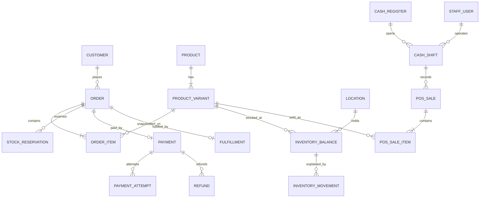

# Domen modeli və invariant-lar

**Status:** Accepted for initial implementation  
**Qeyd:** Bu sənəd konseptual modeldir. Prisma schema yaradılarkən adlar dəyişə bilər, lakin invariant-lar ayrıca qərar olmadan dəyişməməlidir.

## Ubiquitous language

- **Variant/SKU:** satılan ən kiçik məhsul vahidi.
- **Location:** mağaza, anbar və ya pickup-a bağlı stok məntəqəsi.
- **On-hand:** fiziki olaraq mövcud say.
- **Reserved:** aktiv sifarişlər üçün ayrılmış say.
- **Available:** `onHand - reserved`.
- **Order:** müştərinin kommersiya öhdəliyi.
- **Payment:** order üzrə pulun provider/COD vəziyyəti.
- **Fulfillment:** order-in hazırlanması və təhvil prosesi.
- **POS sale:** mağazadaxili tamamlanmış satış sənədi.
- **Cash shift:** kassirin konkret register üzrə açıq iş növbəsi.

## Aggregate sərhədləri

### Identity

`Customer` müştəri profilinin root-u, `StaffUser` isə staff identity root-udur. Onların session və auth axınları ayrı saxlanır.

Əsas entity-lər:

- `Customer`, `CustomerAddress`, `CustomerSession`
- `StaffUser`, `Role`, `Permission`, `StaffSession`
- `AuditLog`

Invariant-lar:

- Customer yalnız öz ünvan və sifarişlərini görə və dəyişə bilər.
- Deaktiv staff yeni session yarada bilməz.
- Təhlükəli staff əməliyyatı role adına deyil, explicit permission-a əsaslanır.
- Audit qeydi append-only-dir və secret/PII diff-i saxlamır.

### Catalog

`Product` marketinq məlumatlarını, `ProductVariant` isə satılan vahidi təqdim edir.

Əsas entity-lər:

- `Category`, `Brand`, `Product`, `ProductVariant`, `ProductMedia`
- `AttributeDefinition`, `AttributeValue`

Invariant-lar:

- Sifariş və stok yalnız variant/SKU-ya bağlanır.
- SKU unikal olmalıdır.
- Aktiv barkod maksimum bir aktiv varianta bağlıdır.
- Arxiv məhsul/variant yeni satışa daxil edilmir, köhnə transaction-larda qalır.
- Media obyektləri private storage-da saxlanır; DB yalnız təhlükəsiz metadata/key saxlayır.

### Pricing

Pricing satıla bilən variant üçün server-side qiymət nəticəsi yaradır.

Konseptual nəticə:

```text
PriceQuote
  variantId
  basePrice
  discountLines[]
  finalUnitPrice
  currency
  calculatedAt
```

Invariant-lar:

- Currency ilkin versiyada yalnız `AZN`-dir.
- Qiymət və endirim decimal arithmetic ilə hesablanır.
- Endirim cəmi uyğun subtotal-dan böyük ola bilməz.
- Checkout/POS client qiymətini qəbul etmir, server yenidən hesablayır.
- Order/POS item final qiyməti snapshot kimi saxlayır.

### Inventory

`InventoryBalance` sürətli cari görünüş, `InventoryMovement` isə dəyişməz ledger-dir. Balance ledger mutation-u ilə eyni transaction-da yenilənir.

Əsas entity-lər:

- `Location`
- `InventoryBalance`
- `InventoryMovement`
- `StockReservation`
- lazım olduqda `StockTransfer`

Invariant-lar:

- Unikal balance: `(variantId, locationId)`.
- `available = onHand - reserved`.
- Default olaraq `onHand >= 0`, `reserved >= 0`, `available >= 0`.
- Quantity səbəbsiz dəyişmir; hər dəyişiklik movement type, actor/source və source document daşıyır.
- Reservation yalnız aktiv, müddəti bitməmiş və həmin order-ə aid olduqda stok tutur.
- Reservation create/release/consume idempotent olmalıdır.
- Paralel checkout row lock və ya ekvivalent DB concurrency nəzarəti ilə oversell yaratmır.

Movement növləri:

- `RECEIPT`
- `SALE`
- `RESERVATION`
- `RESERVATION_RELEASE`
- `TRANSFER_OUT`, `TRANSFER_IN`
- `RETURN`
- `ADJUSTMENT`
- `DAMAGE`
- reversal tələb olunarsa original movement-a reference verən ayrıca movement

### Cart

`Cart` müvəqqəti seçimdir və kommersiya öhdəliyi deyil.

Invariant-lar:

- Eyni variant cart-da bir sətirdə birləşdirilir.
- Cart qiyməti göstəricidir; checkout-da yenidən hesablanır.
- Guest cart authenticated cart-a merge edilərkən quantity limit və availability yenidən yoxlanır.
- Arxiv/out-of-stock item checkout-a səssiz keçmir.

### Order

`Order` root-u item snapshot, totals, address/pickup snapshot və status history-ni idarə edir.

Əsas entity-lər:

- `Order`, `OrderItem`, `OrderAddress`, `OrderStatusHistory`

Totals:

```text
grandTotal = subtotal - discountTotal + deliveryFee + taxTotal
```

Invariant-lar:

- `grandTotal >= 0`.
- Bütün money field-lər eyni currency-dədir.
- Order number insan tərəfindən oxunan və unikaldır; daxili ID-ni əvəz etmir.
- Item adı, SKU/barkod, vergi, unit price və discount order zamanı snapshot-dır.
- Address və delivery fee sonradan source config dəyişsə də tarixi order-i dəyişmir.
- Status keçidi state machine tərəfindən yoxlanır və history yazır.
- Order, payment və fulfillment statusları bir field-də birləşdirilmir.
- Ləğv side effect-ləri payment və inventory ilə uzlaşdırılmadan “bitmiş” sayılmır.

### Payment

`Payment` order üzrə ümumi payment vəziyyətini, `PaymentAttempt` isə provider cəhdini saxlayır.

Əsas entity-lər:

- `Payment`, `PaymentAttempt`, `PaymentEvent`, `Refund`

Invariant-lar:

- Provider payment ID uyğun provider daxilində unikaldır.
- Provider event duplicate gələ bilər və bir dəfə tətbiq olunur.
- `paid + pending` order total-dan artıq olduqda avtomatik qəbul edilmir.
- Refund cəmi captured/paid məbləğdən böyük ola bilməz.
- Amount, currency və order reference uyğun gəlməyən callback security event-dir.
- Frontend redirect payment həqiqəti deyil.
- PAN, CVV və tam kart məlumatı saxlanmır və loglanmır.
- Production-da mock provider seçilərsə tətbiq startup-da dayanır.

### Fulfillment

`Fulfillment` hazırlanma və təhvil prosesidir; `DELIVERY` və ya `PICKUP` tipindədir.

Əsas entity-lər:

- `Fulfillment`, `FulfillmentEvent`
- `DeliveryZone`
- `PickupLocation`

Invariant-lar:

- Seçilmiş delivery ünvanı aktiv zonaya uyğun olmalıdır.
- Pickup yalnız aktiv pickup location və ona bağlı stock location ilə mümkündür.
- Delivery fee yalnız serverdə hesablanır və order-də snapshot olur.
- Fulfillment keçidi öz state machine-i ilə yoxlanır.
- “Ready” bildirişi transition commit olduqdan sonra outbox vasitəsilə göndərilir.

### POS və cash register

Əsas entity-lər:

- `CashRegister`, `CashShift`, `CashMovement`
- `PosSale`, `PosSaleItem`, `PosPayment`, `PosReturn`

Invariant-lar:

- Register üzrə eyni anda icazə verilən aktiv shift sayı biznes qərarı ilə təsdiqlənməli, ilkin olaraq maksimum bir olmalıdır.
- Kassir yalnız öz aktiv shift-i ilə satış edir.
- Sale, payment, inventory movement və receipt number bir transaction-da yaranır.
- Retry eyni sale-i təkrar yaratmır.
- `expectedCash = openingFloat + cashSales + cashIn - cashRefunds - cashOut`.
- Shift bağlanarkən counted cash və difference saxlanır; fərq silinmir.
- External terminal card təsdiqi reference və audit tələb edir.
- Return original sale/item ilə bağlıdır və qaytarıla bilən quantity-ni keçmir.
- Stoka qayıdan malın satıla bilən/damaged location qərarı explicit-dir.

### Reports

Report modulu derived read model-dir.

Invariant-lar:

- Maliyyə total-ları order adı və ya UI event-dən deyil, payment/refund/source transaction-lardan hesablanır.
- Gün sərhədi `Asia/Baku`, saxlanma UTC-dir.
- Export paginated/queued olur; request daxilində limitsiz dataset yaradılmır.
- Pre-aggregation source data ilə reconciliation testindən keçir.

## Konseptual əlaqələr



ERD fizik schema-nı tam göstərmir; index, FK, unique constraint və audit metadata migration review zamanı ayrıca yoxlanmalıdır.

## Transaction sərhədləri

Eyni DB transaction-da olmalıdır:

- inventory movement + balance update;
- order create + item/address snapshot + initial reservation;
- payment event apply + payment status + uyğun order transition/outbox;
- POS sale + payment + inventory movement + receipt allocation;
- refund record + payment status; inventory return ayrıca biznes qərarıdır, amma etibarlı orchestration tələb edir.

Xarici HTTP çağırışı DB transaction daxilində saxlanmamalıdır. Əvvəl intent/outbox commit edilir, sonra provider çağırılır və nəticə idempotent tətbiq olunur.

## Açıq domen qərarları

Aşağıdakılar implementation-dan əvvəl uyğun Product/Finance/Operations sahibi ilə təsdiqlənməlidir:

- vergi hesablanması və qiymətə daxil olub-olmaması;
- register üzrə paralel shift qaydası;
- reservation timeout;
- partial fulfillment və split shipment ehtiyacı;
- return pəncərəsi və approval limitləri;
- COD eligibility və toplama qaydası;
- stock transfer-in iki mərhələli qəbul prosesi;
- order number və fiscal receipt number formatı.

Sahib, son faza gate-i və cari vəziyyət üçün vahid source of truth:
[open-decisions.md](open-decisions.md). Bu siyahı domen kontekstini göstərir; qərarın bağlanması yalnız register-də təsdiq qeydi ilə aparılır.
