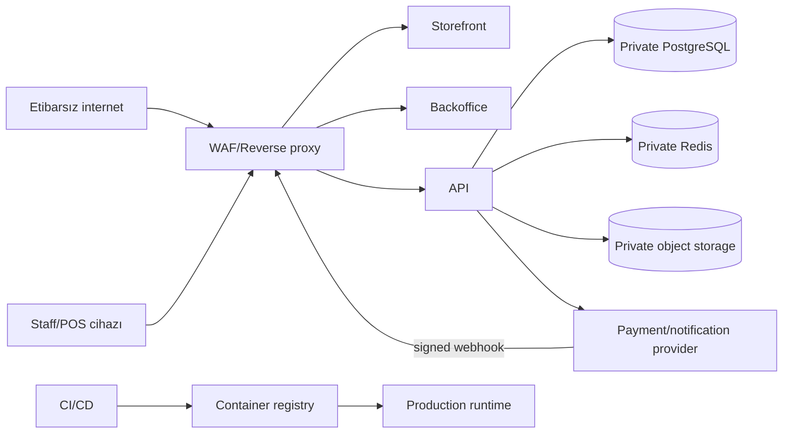

# Təhlükəsizlik threat model-i

**Status:** Accepted baseline for initial implementation; production security review deyil və hər böyük inteqrasiya/trust boundary dəyişikliyində yenilənməlidir.  
**Metod:** asset/trust-boundary əsaslı STRIDE təhlili.

## Qorunan aktivlər

- staff və customer session-ları;
- şəxsi məlumatlar və ünvanlar;
- məhsul qiyməti və promotion qaydaları;
- inventory balance, movement və reservation;
- order, payment, refund, POS və cash shift qeydləri;
- merchant/provider credential-ları;
- audit log və correlation məlumatı;
- object storage media faylları;
- backup-lar və deployment secret-ləri.

Kart PAN/CVV sistemin aktivi olmamalıdır: provider-hosted checkout ilə sistemə daxil edilməməlidir.

## Trust boundary-lər

Əsas sərhədlər:

- browser ↔ public web/API;
- staff device ↔ backoffice/API;
- public webhook ↔ payment adapter;
- app runtime ↔ database/cache/storage;
- CI/CD ↔ registry/runtime;
- operator ↔ production data və secret manager.

## Threat-lər və mitigasiya

### Broken access control / IDOR

Risk: customer başqa order-i, staff icazəsiz refund/stock/price əməliyyatını icra edir.

Mitigasiya:

- hər use-case-də server-side ownership/permission check;
- explicit permission-lar: price change, adjustment, refund, manual discount, shift approval, staff management;
- unguessable daxili ID + ownership query; yalnız ID-nin çətin tapılmasına etibar etmə;
- role/tenant-like filter repository query-sinə daxil edilir;
- denial və təhlükəli mutation audit edilir;
- authorization matrix integration/E2E testləri.

### Customer/staff session qarışması

Risk: customer token-i staff endpoint-də qəbul edilir və ya cookie collision olur.

Mitigasiya:

- ayrı issuer/audience, cookie adı, route namespace və Redis namespace;
- token/session validation endpoint sinfinə görə explicit-dir;
- refresh rotation, revocation və reuse detection;
- staff üçün daha sərt TTL, inactivity timeout və MFA-ready model;
- logout/password reset/deactivation session-ları revoke edir.

### CSRF

Risk: cookie əsaslı authenticated mutation başqa saytdan başladılır.

Mitigasiya:

- `SameSite` uyğun siyasət, `Secure`, `HttpOnly`;
- state-changing request-lərdə CSRF token və Origin/Referer yoxlaması;
- CORS exact allowlist, credential ilə wildcard qadağandır;
- GET mutation etmir.

### XSS

Risk: product description, staff input və ya URL vasitəsilə script icrası/session abuse.

Mitigasiya:

- framework escaping; raw HTML default qadağan;
- rich text lazımdırsa allowlist sanitizer;
- Content Security Policy, `frame-ancestors`, MIME sniffing protection;
- URL scheme allowlist;
- session token JavaScript-ə açılmır;
- user input-u log/admin UI-da təhlükəsiz render et.

### SQL/NoSQL/command injection

Risk: filter/sort/export və operator input-u query və ya shell əmrinə çevrilir.

Mitigasiya:

- Prisma parametrli query;
- raw SQL yalnız review edilmiş parametrli helper-də;
- filter/sort allowlist;
- request schema validation və length limit;
- user input shell command-a əlavə edilmir;
- DB user least privilege.

### SSRF

Risk: media URL, webhook callback və provider config daxili endpoint-ə request yaradır.

Mitigasiya:

- server-side arbitrary URL fetch default qadağan;
- provider host allowlist və HTTPS;
- redirect limiti və private/link-local IP bloklanması;
- cloud metadata endpoint bloklanır;
- outbound egress imkan daxilində allowlist edilir.

### Webhook spoofing/replay

Risk: saxta və ya təkrar callback order-i paid edir.

Mitigasiya:

- signature raw body üzərində, constant-time comparison ilə yoxlanır;
- timestamp/nonce varsa replay window tətbiq edilir;
- provider event ID unique constraint;
- amount, currency, merchant və order reference yoxlanır;
- duplicate/out-of-order event idempotent işlənir;
- signature failure rate alert edilir;
- raw body həssas data ehtiva edirsə persistent loglanmır.

### Price və cart manipulyasiyası

Risk: client aşağı qiymət, saxta endirim və delivery fee göndərir.

Mitigasiya:

- server variantı yenidən yükləyib qiyməti hesablayır;
- promo eligibility backend-dədir;
- delivery/pickup eligibility və fee serverdədir;
- order item/totals snapshot saxlanır;
- uyğunsuz client dəyəri rədd edilir və ya nəzərə alınmır.

### Inventory race/oversell

Risk: concurrent checkout mövcud saydan çox rezerv edir.

Mitigasiya:

- DB transaction və row-level lock/atomic conditional update;
- balance constraint-ləri;
- idempotent reservation;
- expiry/payment yarışı integration test;
- inventory reconciliation və mismatch alert.

### POS scanner input injection

Risk: skaner kimi görünən input aktiv formaya və ya təhlükəli shortcut-a daxil olur.

Mitigasiya:

- bounded buffer, timing/terminator qaydası və maksimum barcode uzunluğu;
- barcode character allowlist;
- scan yalnız POS context-də explicit handler-ə gedir;
- scanner input heç vaxt HTML/command kimi icra edilmir;
- fokus və manual typing fallback təhlükəsiz ayrılır.

### File upload və object storage

Risk: executable fayl, böyük payload, path traversal və public PII exposure.

Mitigasiya:

- size, MIME və magic-byte yoxlaması;
- generated object key; user filename path kimi istifadə edilmir;
- image decode/re-encode və malware scan imkan daxilində;
- bucket private, qısaömürlü signed URL;
- upload/download authorization;
- SVG aktiv content siyasəti ayrıca müəyyən edilir, default reject.

### Brute force və credential stuffing

Mitigasiya:

- IP + identity əsaslı rate limit və progressive backoff;
- generic login/reset error;
- təhlükəsiz password hash parametrləri;
- leaked/common password siyasəti imkan daxilində;
- staff login anomaliyası alert/audit;
- admin üçün MFA production gate kimi qiymətləndirilir.

### Sensitive data exposure

Mitigasiya:

- TLS hər yerdə;
- secret manager və rotation;
- structured logging redaction;
- response DTO yalnız lazım olan field-ləri çıxarır;
- backup encryption və access audit;
- non-production-a production dump verilməməsi;
- PII retention/anonymization siyasəti.

### Supply chain və CI/CD

Mitigasiya:

- lockfile və frozen install;
- dependency/container vulnerability scan;
- minimal, non-root container və pinned base image;
- CI secret-ləri fork/untrusted job-a açılmır;
- artifact provenance/signing imkan daxilində;
- protected branch, review və least-privilege deploy identity.

### Denial of service

Mitigasiya:

- edge və application rate limit;
- body/upload limit;
- pagination və export queue;
- DB connection pool limit;
- provider timeout/circuit-breaker davranışı;
- queue concurrency və backpressure;
- cache outage zamanı təhlükəsiz degradation.

### Audit tampering

Mitigasiya:

- append-only application contract;
- audit table-a məhdud DB permission;
- before/after metadata allowlist və redaction;
- actor, action, entity, correlation ID, IP/user-agent;
- kritik audit export/retention və monitorinq;
- audit yazılmadan kritik mutation commit olmur.

## Data classification

- **Secret:** password hash, refresh secret, provider key, DB credential. Yalnız secret manager/runtime.
- **Restricted PII:** telefon, email, ünvan, IP. Need-to-know access, encryption və retention.
- **Internal:** cost price, stock, reports, audit metadata. Staff permission tələb edir.
- **Public:** aktiv product/catalog məlumatı və açıqlanmış qiymət.

Data classification DTO, log, analytics və backup siyasətinə tətbiq edilməlidir.

## Security header baseline

- HSTS production-da
- Content-Security-Policy
- `X-Content-Type-Options: nosniff`
- `Referrer-Policy`
- `Permissions-Policy`
- clickjacking üçün CSP `frame-ancestors`
- cache policy: auth/PII response-larda public cache qadağan

Header dəyərləri deploy domain və payment redirect ehtiyacına görə test edilməlidir; CSP-ni səbəbsiz `unsafe-*` ilə zəiflətmək olmaz.

## Privacy və retention

Production-dan əvvəl hüquq sahibi aşağıdakıları təsdiqləməlidir:

- hansı PII-nin hansı hüquqi əsasla toplandığı;
- order/fiscal record üçün məcburi retention;
- customer deletion zamanı anonymization sərhədi;
- audit və security log retention;
- backup-dan silinmənin praktiki müddəti;
- üçüncü tərəf payment/notification processor-ları.

Maliyyə və audit qeydləri hard delete edilmir; hüquqi tələbə uyğun PII anonymization ayrıca use-case olur.

## Security verification

Hər release:

- SAST/dependency/container/secret scan;
- authz matrix və webhook negative test;
- security header və CORS yoxlaması;
- production config-də debug/mock provider blokunun yoxlanması.

Production launch-dan əvvəl:

- threat-model review;
- payment callback və refund abuse test;
- privilege escalation test;
- backup access/restore test;
- yüksək riskli finding-lərin bağlanması.

## Qalıq risk və açıq qərarlar

- Epoint/BirPay/AzeriCard imza və callback spesifikasiyası merchant sənədi alınana qədər təsdiqlənməyib.
- Azərbaycan şəxsi məlumat, fiskal və consumer-rights tələbləri hüquq/maliyyə review gözləyir.
- Admin MFA-nın ilkin launch üçün məcburiliyi qərarlaşdırılmalıdır.
- Malware scanning provider-i və media moderation siyasəti seçilməyib.
- WAF, secret manager və hosting provider seçimi deployment threat-lərini dəyişəcək.

Bu maddələr [risk register](risk-register.md) və [launch checklist](production-launch-checklist.md) ilə izlənir.

## İnsident

Aktiv kompromis şübhəsində funksional düzəlişdən əvvəl:

1. təsiri məhdudlaşdır;
2. sübut və log retention-u qoru;
3. secret/session rotation scope-unu müəyyən et;
4. payment və inventory reconciliation apar;
5. hüquqi notification öhdəliyini qiymətləndir;
6. root-cause və preventive action yaz.

Əməliyyat addımları: [operations-runbook.md](operations-runbook.md).
