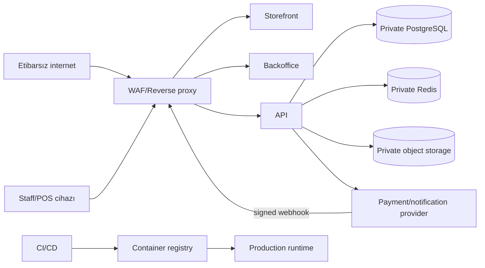

# Təhlükəsizlik threat model-i

**Status:** Accepted baseline for initial implementation; production security review deyil və hər böyük inteqrasiya/trust boundary dəyişikliyində yenilənməlidir.  
**Metod:** asset/trust-boundary əsaslı STRIDE təhlili.

## Qorunan aktivlər

- staff və customer session-ları;
- şəxsi məlumatlar və ünvanlar;
- məhsul qiyməti və promotion qaydaları;
- inventory balance, movement və reservation;
- order, payment, refund, POS və cash shift qeydləri;
- merchant/provider credential-ları;
- audit log və correlation məlumatı;
- object storage media faylları;
- backup-lar və deployment secret-ləri.

Kart PAN/CVV sistemin aktivi olmamalıdır: provider-hosted checkout ilə sistemə daxil edilməməlidir.

## Trust boundary-lər

```mermaid
flowchart LR
  Internet[Etibarsız internet] --> Edge[WAF/Reverse proxy]
  Edge --> SF[Storefront]
  Edge --> BO[Backoffice]
  Edge --> API[API]
  StaffDevice[Staff/POS cihazı] --> Edge
  API --> DB[(Private PostgreSQL)]
  API --> Redis[(Private Redis)]
  API --> S3[(Private object storage)]
  API --> Providers[Payment/notification provider]
  Providers -->|signed webhook| Edge
  CI[CI/CD] --> Registry[Container registry]
  Registry --> Runtime[Production runtime]
```

Əsas sərhədlər:

- browser ↔ public web/API;
- staff device ↔ backoffice/API;
- public webhook ↔ payment adapter;
- app runtime ↔ database/cache/storage;
- CI/CD ↔ registry/runtime;
- operator ↔ production data və secret manager.

## Threat-lər və mitigasiya

### Broken access control / IDOR

Risk: customer başqa order-i, staff icazəsiz refund/stock/price əməliyyatını icra edir.

Mitigasiya:

- hər use-case-də server-side ownership/permission check;
- explicit permission-lar: price change, adjustment, refund, manual discount, shift approval, staff management;
- unguessable daxili ID + ownership query; yalnız ID-nin çətin tapılmasına etibar etmə;
- role/tenant-like filter repository query-sinə daxil edilir;
- denial və təhlükəli mutation audit edilir;
- authorization matrix integration/E2E testləri.

### Customer/staff session qarışması

Risk: customer token-i staff endpoint-də qəbul edilir və ya cookie collision olur.

Mitigasiya:

- ayrı issuer/audience, cookie adı, route namespace və Redis namespace;
- token/session validation endpoint sinfinə görə explicit-dir;
- refresh rotation, revocation və reuse detection (rotated refresh təkrar
  istifadə olunanda rotation zənciri revoke + audit);
- staff üçün daha sərt TTL, **inactivity timeout** (`STAFF_INACTIVITY_TTL_MS`,
  default 30 dəq; `StaffSession.lastActivityAt` slide) və MFA-ready model;
- logout/password reset/deactivation session-ları revoke edir.

### CSRF

Risk: cookie əsaslı authenticated mutation başqa saytdan başladılır.

Mitigasiya:

- `SameSite` uyğun siyasət, `Secure`, `HttpOnly`;
- state-changing request-lərdə **Origin / `Sec-Fetch-Site` yoxlaması** (Nest API `app.setup.ts`; storefront BFF eyni model);
- CSRF token əlavə tələb deyil — browser-lər Origin göndərməyəndə `Sec-Fetch-Site: cross-site` bloklanır; non-browser client-lər CORS allowlist + capability/session token-ə tabedir;
- CORS exact allowlist, credential ilə wildcard qadağandır;
- GET mutation etmir (payment claim cookie yazması istisna: capability token absorb + dərhal redirect).

### XSS

Risk: product description, staff input və ya URL vasitəsilə script icrası/session abuse.

Mitigasiya:

- framework escaping; raw HTML default qadağan;
- rich text lazımdırsa allowlist sanitizer;
- Content Security Policy, `frame-ancestors`, MIME sniffing protection;
- URL scheme allowlist;
- session token JavaScript-ə açılmır;
- user input-u log/admin UI-da təhlükəsiz render et.

### SQL/NoSQL/command injection

Risk: filter/sort/export və operator input-u query və ya shell əmrinə çevrilir.

Mitigasiya:

- Prisma parametrli query;
- raw SQL yalnız review edilmiş parametrli helper-də;
- filter/sort allowlist;
- request schema validation və length limit;
- user input shell command-a əlavə edilmir;
- DB user least privilege.

### SSRF

Risk: media URL, webhook callback və provider config daxili endpoint-ə request yaradır.

Mitigasiya:

- server-side arbitrary URL fetch default qadağan;
- provider host allowlist və HTTPS (`SEO_AI_BASE_URL` →
  `assertSafeSeoAiBaseUrl` / `SEO_AI_ALLOWED_HOSTS`; private/link-local IP
  bloklanır; LLM `fetch` `redirect: 'error'`);
- redirect limiti və private/link-local IP bloklanması;
- cloud metadata endpoint bloklanır;
- outbound egress imkan daxilində allowlist edilir.

### Webhook spoofing/replay

Risk: saxta və ya təkrar callback order-i paid edir.

Mitigasiya:

- signature raw body üzərində, constant-time comparison ilə yoxlanır;
- timestamp/nonce: mock `occurredAt` və Epoint time field-ləri
  (`unix_timestamp` / `operation_time` / …) `WEBHOOK_MAX_AGE_SECONDS`
  (default 900s) replay window-da yoxlanır; eyni `providerEventId` unique;
- provider event ID unique constraint;
- amount, currency, merchant və order reference yoxlanır;
- duplicate/out-of-order event idempotent işlənir;
- signature failure rate alert edilir;
- raw body həssas data ehtiva edirsə persistent loglanmır.
- Epoint imza algoritmi (public spec): `SHA1(base64)` of
  `privateKey + data + privateKey` — `epointSignature` / contract test.

### Müştəri ləğvi ilə avtomatik paid refund abuse

Risk: müştəri tez-tez online ödəniş edib dərhal ləğv edərək refund trafikini,
provider limitlərini və ya chargeback/fraud siqnallarını artırır; həmçinin ownership
olmayan sifarişə refund cəhdi.

Mitigasiya ([ADR-0006](adr/0006-customer-paid-order-cancellation.md)):

- ləğv yalnız `PENDING_PAYMENT | UNDER_REVIEW | CONFIRMED` statusunda;
  `PROCESSING` və sonrakı mərhələdə müştəri ləğvi yoxdur;
- ownership check hər cancel request-də server-side;
- PAID online sifarişdə avtomatik refund idempotency açarı `order-cancel:{orderId}`;
- `OrderStatusHistory.actorType=CUSTOMER`, audit log və `orders.cancelled` outbox;
- customer cancel endpoint üçün auth + IP/identity rate limit
  (`customer-order-cancel` throttle, 5 uğurlu / saat);
- tez-tez ödə→ləğv et pattern-i monitorinq və manual review trigger-i;
- staff paid cancel/refund hələ də `sales.refund` tələb edir — asimmetriya sənədlidir.

### Price və cart manipulyasiyası

Risk: client aşağı qiymət, saxta endirim və delivery fee göndərir.

Mitigasiya:

- server variantı yenidən yükləyib qiyməti hesablayır;
- promo eligibility backend-dədir;
- delivery/pickup eligibility və fee serverdədir;
- order item/totals snapshot saxlanır;
- uyğunsuz client dəyəri rədd edilir və ya nəzərə alınmır.

### Inventory race/oversell

Risk: concurrent checkout mövcud saydan çox rezerv edir.

Mitigasiya:

- DB transaction və row-level lock/atomic conditional update;
- balance constraint-ləri;
- idempotent reservation;
- expiry/payment yarışı integration test;
- inventory reconciliation və mismatch alert.

### POS scanner input injection

Risk: skaner kimi görünən input aktiv formaya və ya təhlükəli shortcut-a daxil olur.

Mitigasiya:

- bounded buffer, timing/terminator qaydası və maksimum barcode uzunluğu;
- barcode character allowlist;
- scan yalnız POS context-də explicit handler-ə gedir;
- scanner input heç vaxt HTML/command kimi icra edilmir;
- fokus və manual typing fallback təhlükəsiz ayrılır.

### File upload və object storage

Risk: executable fayl, böyük payload, path traversal və public PII exposure.

Mitigasiya:

- size, MIME allowlist və magic-byte (sniff) yoxlaması; declared MIME məzmunla uyğun olmalıdır;
- generated object key; user filename path kimi istifadə edilmir;
- upload-dan əvvəl `MEDIA_MALWARE_SCAN` (`local` default; opsional `clamav`);
- bucket private, qısaömürlü signed URL;
- upload/download authorization (staff `catalog.write`);
- SVG/HTML/script prefix reject; müştəri UGC şəkil upload-u yoxdur.

### Brute force və credential stuffing

Mitigasiya:

- IP + identity əsaslı rate limit və progressive backoff;
- generic login/reset error;
- təhlükəsiz password hash parametrləri;
- leaked/common password siyasəti imkan daxilində;
- staff login anomaliyası alert/audit;
- admin üçün MFA production gate kimi qiymətləndirilir.

### Sensitive data exposure

Mitigasiya:

- TLS hər yerdə;
- secret manager və rotation;
- structured logging redaction;
- response DTO yalnız lazım olan field-ləri çıxarır;
- backup encryption və access audit;
- non-production-a production dump verilməməsi;
- PII retention siyasəti (D-014: daimi saxlama; avtomatik anonymization yoxdur);
- guest cart capability və payment attempt token DB-də SHA-256 hash-at-rest
  (`Cart.guestTokenHash`, `PaymentAttempt.providerCheckoutToken`); plaintext
  yalnız client cookie/header və create/handoff cavabında; stored hash bearer
  kimi qəbul edilmir; idempotent checkout capability token-i rotate edir;
- support chat thread `guestTokenHash` saxlayır; SSE EventSource məhdudiyyətinə
  görə query token qalığı [qalıq risk](#qalıq-risk-və-açıq-qərarlar)-də izlənilir;
- checkout `finCode` (Azərbaycan FIN) Restricted PII — yalnız installment/kredit
  axınında, staff need-to-know.

### Catalog SEO LLM egress (süni zəka)

Risk: staff SEO düyməsi və ya yanlış inteqrasiya vasitəsilə ödəniş, sifariş və ya
müştəri PII xarici LLM provider-ə sızır; `SEO_AI_API_KEY` digər secret-lərlə
qarışır.

Mitigasiya:

- `SeoAiModule` yalnız `AuthModule` import edir — Prisma / Payments / Orders /
  Customers injection yoxdur; LLM sorğusu DB-dən user/payment oxumur;
- endpoint: `POST /catalog/seo/suggest`, staff + `catalog.write`, distributed
  `LoginThrottle` (`seo-suggest`, 30/dəq/staff + IP);
- `SEO_AI_BASE_URL` HTTPS + host allowlist (`generativelanguage.googleapis.com`,
  `api.openai.com`, `api.anthropic.com`) və private IP reject;
- outbound payload **allowlist** (`seo-ai-boundary`): `entityType`, `brand`,
  `model`, `category`, `parentCategory`, `specs`, `existingDescription`;
- email / AZ telefon / kart / IBAN / CVV / FIN pattern və sensitive spec label
  (email, kart, ödəniş, …) aşkarlananda `400` — egress yox;
- system prompt SEO-only scope; cavab yalnız `seoTitle` / `seoDescription` /
  `description` parse olunur;
- `SEO_AI_API_KEY` ayrıca SEO LLM açarıdır — Epoint/payment secret ilə
  eyni dəyər olmamalıdır.

### Supply chain və CI/CD

Mitigasiya:

- lockfile və frozen install;
- dependency/container vulnerability scan;
- minimal, non-root container və pinned base image;
- CI secret-ləri fork/untrusted job-a açılmır;
- artifact provenance/signing imkan daxilində;
- protected branch, review və least-privilege deploy identity.

### Denial of service

Mitigasiya:

- edge və application rate limit (cart create 30/saat/IP; cart mutate 120/saat;
  checkout cash/online 20/saat/IP; login/payment/SEO throttle-lar);
- `TRUST_PROXY_HOPS` + `getClientIp`: XFF yalnız etibarlı hop sayına görə;
  production-da hop dəyəri explicit; birbaşa expose-da `0`;
- body/upload limit;
- pagination və export queue;
- DB connection pool limit;
- provider timeout/circuit-breaker davranışı;
- queue concurrency və backpressure;
- cache outage zamanı təhlükəsiz degradation.

### Audit tampering

Mitigasiya:

- append-only application contract;
- audit table-a məhdud DB permission;
- before/after metadata allowlist və redaction;
- actor, action, entity, correlation ID, IP/user-agent;
- kritik audit export/retention və monitorinq;
- audit yazılmadan kritik mutation commit olmur.

## Data classification

- **Secret:** password hash, refresh secret, provider key, DB credential, cart/payment capability token (plaintext yalnız client-də). Yalnız secret manager/runtime və ya hash-at-rest.
- **Restricted PII:** telefon, email, ünvan, IP, `finCode` (FIN). Need-to-know access, encryption və retention.
- **Internal:** cost price, stock, reports, audit metadata. Staff permission tələb edir.
- **Public:** aktiv product/catalog məlumatı və açıqlanmış qiymət.

Data classification DTO, log, analytics və backup siyasətinə tətbiq edilməlidir.

## Security header baseline

- HSTS production-da
- Content-Security-Policy
- `X-Content-Type-Options: nosniff`
- `Referrer-Policy`
- `Permissions-Policy`
- clickjacking üçün CSP `frame-ancestors`
- cache policy: auth/PII response-larda public cache qadağan

Header dəyərləri deploy domain və payment redirect ehtiyacına görə test edilməlidir; CSP-ni səbəbsiz `unsafe-*` ilə zəiflətmək olmaz.

## Privacy və retention

**D-014 (qəbul, 2026-07-28):** Müştəri PII daimi saxlanılır; avtomatik anonymization/silinmə job-u yoxdur.

Digər production təsdiqləri:

- hansı PII-nin hansı hüquqi əsasla toplandığı (privacy/cookie mətnləri);
- audit və security log retention;
- üçüncü tərəf payment/notification processor-ları.

Maliyyə və audit qeydləri hard delete edilmir. Avtomatik PII anonymization use-case-i scope xaricindədir (D-014).

## Security verification

Hər release:

- SAST/dependency/container/secret scan;
- authz matrix və webhook negative test;
- security header və CORS yoxlaması;
- production config-də debug/mock provider blokunun yoxlanması.

Production launch-dan əvvəl:

- threat-model review;
- payment callback və refund abuse test;
- privilege escalation test;
- backup access/restore test;
- yüksək riskli finding-lərin bağlanması.

## Qalıq risk və açıq qərarlar

- Epoint/BirPay/AzeriCard **merchant credential / installment capability**
  mapping (D-012) sandbox təsdiqi gözləyir; public-spec SHA1/base64 imza
  algoritmi kodda bağlanıb və contract test ilə sabitləşdirilib.
- Azərbaycan fiskal və consumer-rights tələbləri hüquq/maliyyə review gözləyir (PII retention: D-014 daimi saxlama).
- Media malware üçün commercial AV vendor (ClamAV-dan kənar) opsional sərtləşdirmədir; D-013 qəbul edilib (`local` / opsional `clamav`; commercial AV məcburi deyil).
- XSS: storefront/backoffice CSP per-request nonce + `strict-dynamic` (script);
  CSP3 `style-src-elem` nonce + `style-src-attr 'unsafe-inline'` (React layout
  attribute styles). Tam attribute-style removal sonrakı sərtləşdirmədir.
- D-015: WAF / secret manager / hosting provider seçimi ops production gate
  olaraq qalır; app-layer mitigasiya: production `load-env` secret override
  etmir, checkout/cart throttle, SEO egress allowlist.

Bağlanmış (2026-07-27 security audit; 2026-07-28 hash-at-rest yeniləməsi; 2026-07-29 hardening):

- Mock payment complete/webhook yalnız `PAYMENT_PROVIDER=mock` və `payment.provider=mock` üçün aktivdir.
- Guest cart `X-Cart-Guest-Token` capability tələb edir; GET cavabında token yoxdur;
  at-rest `guestTokenHash` (SHA-256), legacy plaintext dual-read + lazy migrate.
- Payment attempt capability token at-rest hash; storefront `/checkout/pay/claim`
  query-dən httpOnly cookie-yə absorb edib təmiz `/checkout/pay`-ə redirect edir.
- Order status yalnız signed `statusToken` ilə oxunur.
- Production: Redis password, `STAFF_MFA_REQUIRED=true`, SMTP TLS+auth məcburidir.
- Password-reset plaintext token notification outbox-da saxlanmır; SMTP fail
  retry yeni token mint edir (yalnız hash at-rest).
- Staff/customer refresh reuse detection: rotated token təkrar istifadə →
  forward rotation chain revoke + audit.
- Production provider checkout redirect yalnız `https`; `PAYMENT_REDIRECT_HOSTS`
  IP/localhost/wildcard qəbul etmir.
- Support chat SSE token query string-də deyil; storefront BFF httpOnly cookie
  + header ilə API-yə ötürür.
- Banner/brand logo upload API `POST /catalog/media/scan` malware gate-indən
  keçir (local polyglot + opsional ClamAV); polyglot sniff backoffice-də də var.
- Payment claim URL: `POST /payments/attempts/:token/claim` token-i rotate edir;
  claim cavabı `Referrer-Policy: no-referrer` + `Cache-Control: no-store`.
- Cart/payment dual-read bağlandı: yalnız hash-at-rest; leftover plaintext scrub.
- FIN kod at-rest AES-256-GCM (`enc:v1:`); oxunuşda reveal (legacy plaintext OK).
- Storefront/backoffice CSP: per-request script nonce + `strict-dynamic`
  (prod-da `unsafe-inline` script yoxdur); `style-src-elem` nonce;
  `style-src-attr 'unsafe-inline'` layout üçün.
- Support-chat messages BFF Origin/`Sec-Fetch-Site` gate; fulfillment BFF
  cartId session bağlanması.
- Account password policy: ≥12 + ≥3 character classes + common-password denylist
  (staff create/update, customer register/reset).
- Payment handoff/claim/continue/webhook IP rate limits (`LoginThrottle`).
- Cart create/mutate və checkout cash/online IP rate limits (`LoginThrottle`).
- CSRF Origin gate: Origin-less mutation yalnız trusted `Sec-Fetch-Site`
  (`same-origin`/`same-site`/`none`); `/webhooks/` path-ləri explicit exempt.
- Guest cart cookies `SameSite=strict`.
- Staff inactivity timeout (`lastActivityAt` + `STAFF_INACTIVITY_TTL_MS`).
- Webhook replay window (`WEBHOOK_MAX_AGE_SECONDS` + mock `occurredAt` /
  Epoint timestamp field extraction).
- SEO AI: distributed throttle; `SEO_AI_BASE_URL` host allowlist + SSRF guard.
- Production `loadMonorepoEnv`: mövcud process.env (secret manager) override
  olunmur.
- `TRUST_PROXY_HOPS` ops qeydi: default **0** (XFF ignore); production-da **explicit**
  set məcburidir; birbaşa expose-da `0`, tək reverse proxy arxasında `1`
  (rate-limit IP spoof). Vendor client-IP header-ləri app-də parse edilmir.

Bu maddələr [risk register](risk-register.md) və [launch checklist](production-launch-checklist.md) ilə izlənir.

## İnsident

Aktiv kompromis şübhəsində funksional düzəlişdən əvvəl:

1. təsiri məhdudlaşdır;
2. sübut və log retention-u qoru;
3. secret/session rotation scope-unu müəyyən et;
4. payment və inventory reconciliation apar;
5. hüquqi notification öhdəliyini qiymətləndir;
6. root-cause və preventive action yaz.

Əməliyyat addımları: [operations-runbook.md](operations-runbook.md).
