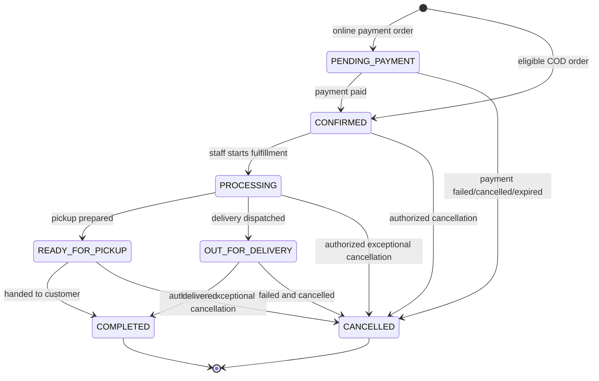
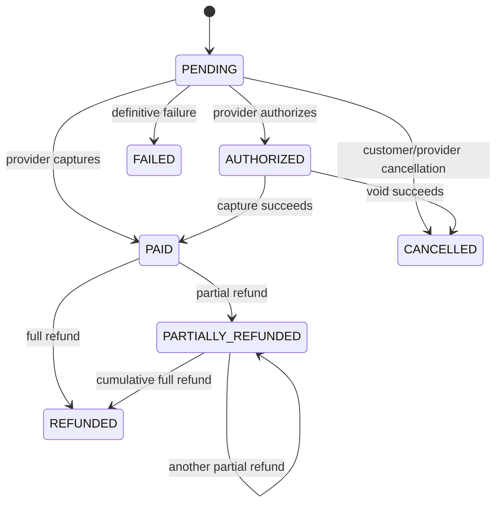
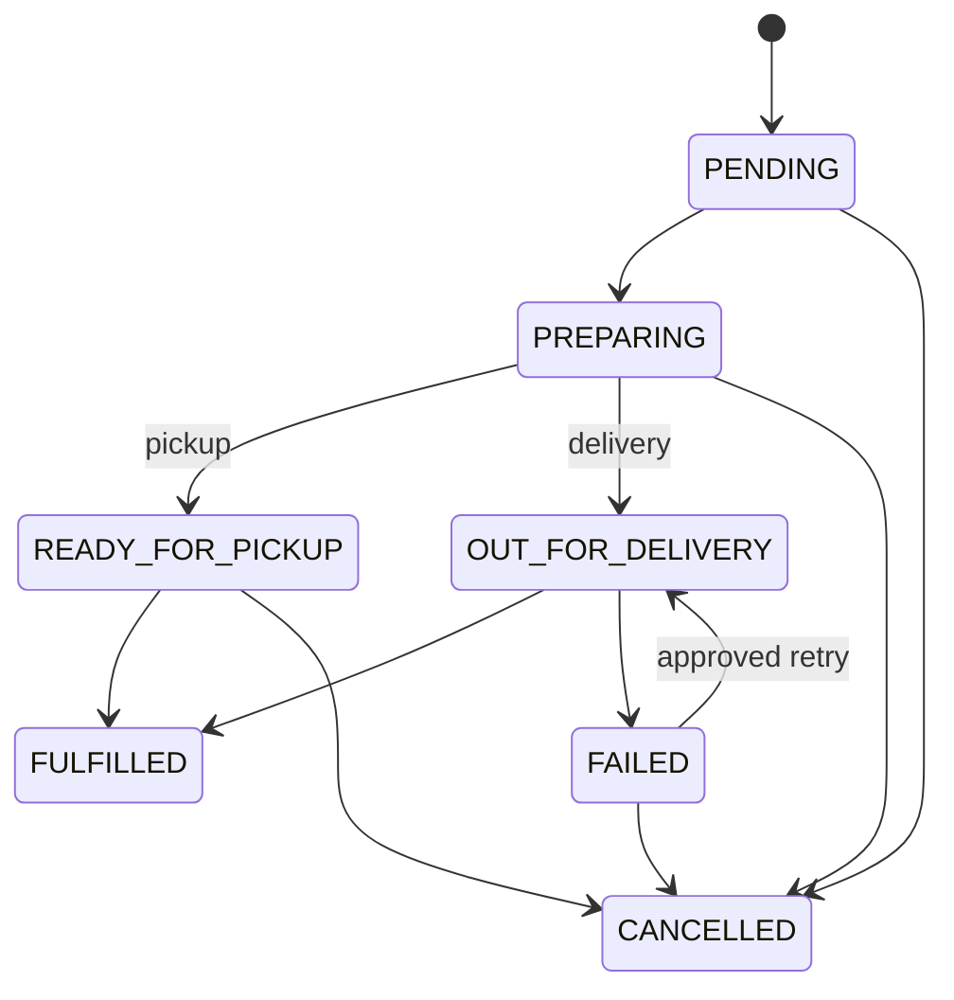
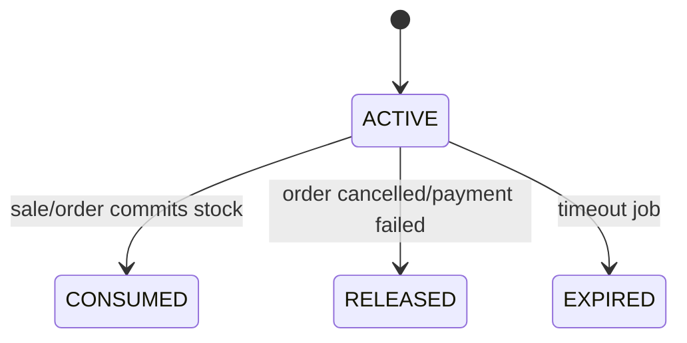
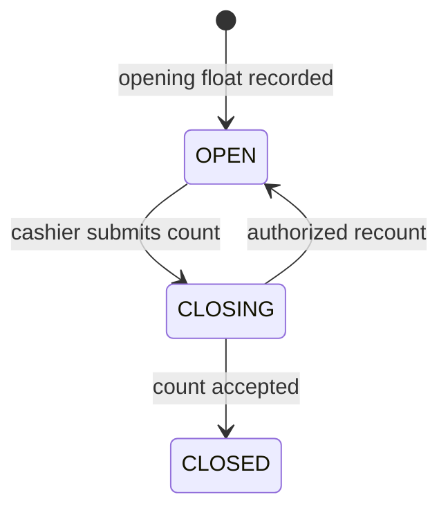

# Status keçidləri

**Status:** Accepted baseline  
**Prinsip:** Order, payment və fulfillment statusları ayrı saxlanır. Birinin dəyişməsi digərini yalnız açıq application use-case vasitəsilə dəyişə bilər.

## Ümumi qaydalar

Hər transition:

- backend-də allowlist ilə yoxlanır;
- actor/system reason və timestamp ilə history yaradır;
- authorization tələb edirsə permission yoxlayır;
- eyni event təkrarlandıqda idempotent davranır;
- side effect-i DB transaction daxilində birbaşa xarici sistemə göndərmir, outbox yaradır;
- gözlənilməyən keçiddə generic 500 deyil, stabil domain error qaytarır.

## Order state machine

Statuslar:

- `PENDING_PAYMENT`
- `CONFIRMED`
- `PROCESSING`
- `READY_FOR_PICKUP`
- `OUT_FOR_DELIVERY`
- `COMPLETED`
- `CANCELLED`

Qaydalar:

- Online payment order yalnız doğrulanmış payment nəticəsindən sonra `CONFIRMED` olur.
- `COMPLETED` və `CANCELLED` terminal biznes statuslarıdır; refund order statusunu geriyə çevirmir.
- Terminal statusdakı səhvi düzəltmək data update ilə deyil, audit edilən compensation/reversal use-case ilə aparılır.
- Ləğv yalnız stok reservation/release və payment cancel/refund nəticəsi izlənə biləndə tamamlanmış sayılır.
- Pickup order `OUT_FOR_DELIVERY`, delivery order `READY_FOR_PICKUP` ola bilməz.

## Payment state machine

Statuslar:

- `PENDING`
- `AUTHORIZED`
- `PAID`
- `FAILED`
- `CANCELLED`
- `PARTIALLY_REFUNDED`
- `REFUNDED`

Qaydalar:

- `FAILED` yalnız provider nəticəsi definitivedirsə verilir; timeout `PENDING` qala və reconciliation tələb edə bilər.
- `PAID` üçün verified provider event və amount/currency/order uyğunluğu tələb olunur.
- Eyni callback/event ikinci transition yaratmır.
- Gecikmiş və out-of-order event cari statusu korlamamalıdır; event saxlanır və transition policy tətbiq edilir.
- Refund cəmi paid amount-u keçmir.
- COD payment statusunun nə vaxt `PAID` olması pickup/delivery collection prosesi ilə ayrıca təsdiqlənməlidir.

## Fulfillment state machine

Tövsiyə olunan statuslar:

- `PENDING`
- `PREPARING`
- `READY_FOR_PICKUP`
- `OUT_FOR_DELIVERY`
- `FULFILLED`
- `FAILED`
- `CANCELLED`

Qaydalar:

- Type `PICKUP` yalnız pickup branch-i, `DELIVERY` yalnız delivery branch-i istifadə edir.
- `FAILED` avtomatik order cancellation demək deyil.
- Retry əvvəlki delivery cəhdini silmir; event tarixçəsinə yeni attempt əlavə edir.
- Partial fulfillment ilk versiyada scope xaricindədir. Tələb yaranarsa yeni ADR və item-level model lazımdır.

## Stock reservation state machine

Statuslar:

- `ACTIVE`
- `CONSUMED`
- `RELEASED`
- `EXPIRED`

Qaydalar:

- Yalnız `ACTIVE` reservation `reserved` quantity-yə təsir edir.
- Terminal reservation ikinci dəfə release/consume ediləndə no-op və ya stabil conflict verir; quantity təkrar dəyişmir.
- Expiration job row lock və status condition ilə payment callback yarışını təhlükəsiz idarə edir.

## Cash shift state machine

Statuslar:

- `OPEN`
- `CLOSING`
- `CLOSED`

Qaydalar:

- Yalnız `OPEN` shift satış və cash movement qəbul edir.
- `CLOSING` yeni satışları bloklayır və race condition-u aradan qaldırır.
- Fərq approval limitini keçərsə manager permission tələb olunur.
- `CLOSED` shift yenidən açılmır; correction ayrıca audit edilən movement/prosedurdur.

## POS return state

Tövsiyə olunan statuslar:

- `REQUESTED`
- `APPROVED`
- `COMPLETED`
- `REJECTED`
- `FAILED`

Return və refund eyni anlayış deyil: məhsulun qəbul edilməsi, stoka yönləndirilməsi və pulun qaytarılması ayrı addımlardır, amma vahid orchestration və audit ilə əlaqələndirilir.

## Error və retry siyasəti

- **Business conflict:** transition tətbiq edilmir, stabil error code qaytarılır.
- **Transient provider failure:** status təhlükəsiz pending vəziyyətdə qalır, retry/reconciliation planlanır.
- **Unknown outcome:** avtomatik əks əməliyyat edilmir; reconciliation və alert yaradılır.
- **Duplicate command:** əvvəlki nəticə qaytarılır.
- **Partial internal failure:** DB transaction rollback edilir.
- **Outbox delivery failure:** domain commit saxlanır, job retry/DLQ-a keçir.

## Test contract

Hər state machine üçün:

1. bütün icazəli keçidlər unit test;
2. bütün qadağan keçidlər parameterized unit test;
3. history/audit və authorization integration test;
4. duplicate və concurrent event integration test;
5. kritik payment/order/inventory kombinasiyaları E2E testlə qorunmalıdır.
