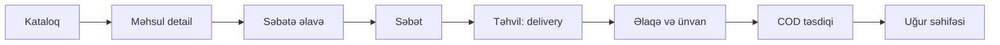
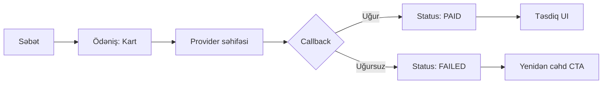
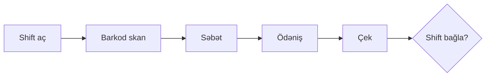

# UI və UX bələdçisi

**Status:** Draft — dizayn işinə başlamaq üçün  
**Son yenilənmə:** 2026-07-14  
**Sahib:** Product + Frontend  
**Əlaqəli sənədlər:** [Storefront modul contract-ı](modules/storefront-cart-checkout.md), [Online payment](modules/online-payment-fulfillment.md), [POS](modules/pos-cash-register.md), [Test strategiyası](testing-strategy.md)

Bu sənəd IT Market-in **vizual dilini**, **istifadəçi axınlarını** və **ekran tələblərini** təsvir edir. Məqsəd hazırkı funksional, lakin zəif polish edilmiş UI-ni real mağaza və operator təcrübəsinə çevirməkdir.

Backend contract, domen invariantları və status keçidləri bu sənədlə **təkrarlanmır** — yalnız istifadəçiyə görünən qat və dizayn qərarları burada toplanır.

---

## 1. Məqsəd və scope

### 1.1 Nə həll edirik?

Hazırkı UI funksional acceptance testlərini keçir, amma:

- mağaza deyil, mühəndislik demo-sı kimi görünür;
- məhsul şəkilləri vitrində göstərilmir;
- səhifələr arasında vahid header/footer yoxdur;
- form-heavy UX (hər miqdar dəyişikliyi tam submit tələb edir);
- developer/internal copy istifadəçiyə açıqdır (`Faza 4`, `Backoffice-dən...`);
- storefront və backoffice tamamilə fərqli vizual dillərdədir, ortaq komponent kitabxanası yoxdur.

### 1.2 Scope

| Daxil | Xaric (hələ) |
| ----- | ------------ |
| Storefront (kataloq, məhsul, səbət, checkout, status) | Müştəri hesabı / auth UI |
| Backoffice operator səthləri (kataloq, stok, sifariş, POS, hesabat) | Figma asset repo (ayrıca dizayn faylı) |
| Ortaq dizayn token-ları və komponent spec-i | Tam brend kitabçası (print, sosial media) |
| Accessibility və responsive qaydalar | Üçüncü tərəf dizayn sistemi (Material, shadcn) birbaşa copy |

### 1.3 Uğur meyarları

- İstifadəçi 3 klikdən az müddətdə məhsul tapıb səbətə əlavə edə bilir.
- Checkout axını mobil ekranda scroll olmadan əsas məlumatları oxunaqlı saxlayır.
- Məhsul kartında şəkil, qiymət, stok və CTA aydın iyerarxiyada görünür.
- Bütün public səhifələrdə eyni naviqasiya shell-i var.
- WCAG 2.1 AA automated check (axe) pozulmur; manual keyboard review keçir.
- Backoffice POS ekranında əsas əməliyyat düymələri minimum 44×44 px toxunma hədəfinə uyğundur.

---

## 2. İstifadəçi personaları

### P1 — Online alıcı (guest)

- **Məqsəd:** Texnologiya məhsulu tapmaq, qiyməti AZN ilə anlamaq, COD və ya online ödəmək.
- **Kontekst:** Mobil telefon, tez qərar, etibar və aydınlıq vacibdir.
- **Ağrı nöqtələri:** Şəkilsiz kataloq, uzun form, texniki status mesajları.

### P2 — Mağaza satıcısı / kassir

- **Məqsəd:** Barkod skan, satış, qaytarma, shift bağlama — sürətli və səhvə dözümlü.
- **Kontekst:** Stresli mühit, klaviatura/skaner, böyük ekran və ya planşet.
- **Ağrı nöqtələri:** Monolit form panel, vizual feedback zəifliyi, POS axınının digər admin UI ilə qarışması.

### P3 — Anbar / kataloq operatoru

- **Məqsəd:** Məhsul, stok, transfer, media idarəetməsi.
- **Kontekst:** Desktop, uzun sessiya, cədvəl və form.
- **Ağrı nöqtələri:** Hər əməliyyat eyni səhifədə; naviqasiya və vizual prioritet zəifdir.

---

## 3. Dizayn prinsipləri

1. **Mağaza birinci** — kataloq və alış yolu hero/marketing blokundan üstün tutulur.
2. **Mobile-first** — layout, tipografiya və toxunma hədəfləri əvvəl mobil üçün, sonra geniş ekran.
3. **Şəffaflıq** — qiymət, çatdırılma haqqı, stok və ödəniş üsulu gizlədilmir; backend hesablaması UI-da aydın göstərilir.
4. **Etibar** — Azərbaycan dili, AZN formatı, real telefon/ünvan sahələri, professional vizual dil.
5. **Accessibility default** — focus, kontrast, landmark, label, error association; dekor accessibility-ni pozmur.
6. **Performans UX-i** — şəkil lazy-load, skeleton state, server component əsaslı render; boş ekran gözləməsi yoxdur.
7. **Operator sürəti** — backoffice-də tez-tez edilən əməliyyatlar (POS satış, barkod axtarış) bir klik/skan məsafəsindədir.

---

## 4. Brend və vizual istiqamət

### 4.1 Seçilmiş istiqamət: *Təmiz texnologiya mağazası*

Referans xarakter (copy etmək deyil, ton götürmək):

- **Təmiz, işıqlı, strukturlu** — Apple Store / MediaMarkt tipli aydın grid
- **Yerli etibar** — AZ dilində birbaşa, formal-deyil, peşəkar
- **Texnologiya, amma soyuq deyil** — neytral fon + bir accent rəng

### 4.2 Logo və mark

| Element | Tələb |
| ------- | ----- |
| Logo | `IT Market` wordmark + sadə monogram (`IM` və ya `it` mark); SVG |
| Favicon | 32×32, 180×180 apple-touch |
| Minimum boşluq | Logo ətrafında minimum 8 px clear space |

**TBD:** Final logo asset — Product sahibi təsdiqi lazımdır.

### 4.3 Rəng palitrası (storefront)

Mövcud editorial palitranı (`#f5f1e8`, Georgia serif hero) **təkmilləşdirmə fazasında əvəz edirik**.

| Token | Dəyər | İstifadə |
| ----- | ----- | -------- |
| `--color-bg` | `#F7F8FA` | Səhifə fonu |
| `--color-surface` | `#FFFFFF` | Kart, panel |
| `--color-text` | `#111827` | Əsas mətn |
| `--color-text-muted` | `#6B7280` | İkinci dərəcəli mətn |
| `--color-border` | `#E5E7EB` | Xətlər, input border |
| `--color-primary` | `#0F766E` | CTA, link, aktiv nav |
| `--color-primary-hover` | `#0D9488` | Hover |
| `--color-accent` | `#EA580C` | Endirim, xəbərdarlıq, promo badge |
| `--color-success` | `#059669` | Uğur mesajı, stokda var |
| `--color-error` | `#DC2626` | Validation, uğursuz ödəniş |
| `--color-warning` | `#D97706` | Az stok, gözləyən ödəniş |

Kontrast: mətn/fon və CTA/fon kombinasiyaları minimum **4.5:1** (normal mətn), böyük başlıq minimum **3:1**.

### 4.4 Rəng palitrası (backoffice)

Storefront-dan **vizual olaraq ayrılır**, amma eyni primary family saxlanılır.

| Token | Dəyər | İstifadə |
| ----- | ----- | -------- |
| `--color-bg` | `#EEF2F6` | Canvas |
| `--color-surface` | `#FFFFFF` | Kart |
| `--color-nav` | `#0F172A` | Header / sidebar |
| `--color-nav-text` | `#F8FAFC` | Header mətn |
| `--color-primary` | `#0F766E` | Aktiv tab, primary action |
| `--color-info` | `#0284C7` | Info badge |

### 4.5 Tipografiya

| Rol | Font | Ölçü (mobil → desktop) | Qeyd |
| --- | ---- | ---------------------- | ---- |
| Display / H1 | **Inter** 700 | 28px → 40px | Məhsul adı, səhifə başlığı |
| H2 | Inter 600 | 22px → 28px | Bölmə başlığı |
| H3 | Inter 600 | 18px → 20px | Kart başlığı |
| Body | Inter 400 | 16px | Əsas mətn; minimum 16px mobil input zoom qarşısını alır |
| Caption / Label | Inter 500 | 12px → 13px | Uppercase label yalnız form label-lərdə |
| Qiymət | Inter 700 | 18px → 22px | Tabular nums (`font-variant-numeric: tabular-nums`) |

**TBD:** Inter self-host və ya `next/font` — performance qərarı Frontend ilə.

Georgia serif hero tipografiyası **storefront-dan çıxarılır**; editorial hero bloku ləğv və ya `/about` səhifəsinə köçürülür.

### 4.6 Spacing və radius

- **Grid unit:** 4 px
- **Standart spacing:** 8, 12, 16, 24, 32, 48, 64
- **Kontainer max-width:** 1200 px (storefront), 1440 px (backoffice content)
- **Border radius:** sm 8px, md 12px, lg 16px, pill 9999px (primary button)
- **Kölgə:** `0 1px 3px rgba(0,0,0,.08), 0 4px 12px rgba(0,0,0,.04)` — kart default

### 4.7 Breakpoint-lər

| Ad | Min width | Davranış |
| -- | --------- | -------- |
| `xs` | 0 | 1 sütun, full-width CTA |
| `sm` | 640px | 2 sütun məhsul grid |
| `md` | 768px | Header horizontal nav |
| `lg` | 1024px | 3 sütun grid, sticky summary |
| `xl` | 1280px | Maksimum kontent eni |

---

## 5. Layout və naviqasiya

### 5.1 Storefront shell (bütün public səhifələr)

```
┌─────────────────────────────────────────────┐
│ Skip link                                   │
├─────────────────────────────────────────────┤
│ Header: Logo | Axtarış | Kateqoriyalar | Səbət (count) │
├─────────────────────────────────────────────┤
│ Breadcrumb (detail/cart/checkout)           │
├─────────────────────────────────────────────┤
│ Main content                                │
├─────────────────────────────────────────────┤
│ Footer: Əlaqə, çatdırılma, hüquqi linklər   │
└─────────────────────────────────────────────┘
```

**Qaydalar:**

- `/`, `/products/*`, `/cart`, `/checkout/*` — eyni header/footer
- Səbət linkində item sayı badge (0 olanda gizli və ya `0` solğun)
- Aktiv səhifə nav link-də `aria-current="page"`
- Mobil: header-da hamburger + axtarış ikonu; kataloq filter drawer

### 5.2 Backoffice shell

```
┌──────────┬──────────────────────────────────┐
│ Sidebar  │ Top bar: istifadəçi, shift, çıxış │
│ (nav)    ├──────────────────────────────────┤
│          │ Page title + breadcrumb           │
│          ├──────────────────────────────────┤
│          │ Content area                      │
└──────────┴──────────────────────────────────┘
```

**Nav qrupları (RBAC-a görə filter):**

1. Kataloq (kateqoriya, brend, məhsul, media)
2. Stok (location, receipt, transfer, balans)
3. Sifarişlər (list, detail, fulfillment)
4. POS (shift, satış, qaytarma)
5. Hesabatlar
6. Admin (staff, audit) — yalnız icazəli rollar

Mobil backoffice: sidebar collapse; POS rejimi tam ekran.

---

## 6. Komponent kitabxanası

Ortaq paket: `packages/ui` (storefront + backoffice). Hər komponent: variant, size, disabled, focus state, a11y prop-ları.

### 6.1 Primitivlər

| Komponent | Variant-lar | Qeyd |
| --------- | ----------- | ---- |
| `Button` | primary, secondary, ghost, danger | min-height 44px |
| `Input`, `Textarea`, `Select` | default, error | label + error id association |
| `Badge` | success, warning, error, neutral | Stok, status |
| `Card` | elevated, outlined | Məhsul, operator panel |
| `Skeleton` | text, rect, circle | Loading |
| `Alert` | info, success, warning, error | Banner mesaj |
| `Modal` | — | Təsdiq dialoqları |
| `Tabs` | — | Backoffice section nav |
| `Breadcrumb` | — | Detail səhifələr |
| `Price` | default, sale, previous | AZN format, köhnə qiymət üstü xətli |
| `QuantityStepper` | — | +/- , min 1, max available |
| `EmptyState` | — | İkon + başlıq + CTA |
| `Spinner` | inline, overlay | Form submit |

### 6.2 Storefront kompozitləri

| Komponent | Təsvir |
| --------- | ------ |
| `SiteHeader` / `SiteFooter` | Ortaq shell |
| `ProductCard` | Şəkil 4:3, brend, ad, qiymət, stok badge, CTA |
| `ProductGallery` | Detail: əsas şəkil + thumbnail strip |
| `CatalogFilters` | Search, category, brand, sort; chip-lərlə aktiv filter |
| `CartLineItem` | Thumbnail, ad, variant, stepper, line total, sil |
| `OrderSummary` | Subtotal, delivery fee, total; sticky mobil footer |
| `CheckoutSteps` | 1. Təhvil → 2. Əlaqə/ünvan → 3. Ödəniş → 4. Təsdiq |
| `FulfillmentPicker` | Delivery vs pickup radio + zone/location select |
| `PaymentMethodPicker` | COD / Card / Installment |
| `OrderStatusPanel` | İnsan dilində status; texniki enum gizli |

### 6.3 Backoffice kompozitləri

| Komponent | Təsvir |
| --------- | ------ |
| `DataTable` | Sort, filter, pagination |
| `OperationCard` | Mövcud form kartının strukturlaşdırılmış versiyası |
| `PosSalePanel` | Barkod input, səbət, ödəniş, çek |
| `ShiftBanner` | Aktiv/bağlı shift vəziyyəti |
| `AuditTrail` | Read-only timeline |

---

## 7. Ekran inventarı

### 7.1 Storefront

| ID | Route | Məqsəd | Prioritet |
| -- | ----- | ------ | --------- |
| SF-01 | `/` | Kataloq (axtarış + filter + grid) | P0 |
| SF-02 | `/products/[slug]` | Məhsul detail, variant, add to cart | P0 |
| SF-03 | `/cart` | Səbət + checkout | P0 |
| SF-04 | `/checkout/success` | COD təsdiqi | P0 |
| SF-05 | `/checkout/status` | Online ödəniş statusu | P0 |
| SF-06 | `/checkout/pay` | Payment handoff (provider redirect) | P1 |
| SF-07 | `/about` | Brend/etibar (opsional hero content) | P2 |
| SF-08 | `/category/[slug]` | Kateqoriya landing (gələcək) | P2 |

#### SF-01 Kataloq — wireframe

```
[ Header ]

[ Axtarış bar — full width mobil ]

[ Filter chip-ləri: Kateqoriya | Brend | Sıralama ]

[ Nəticə: "24 məhsul" ]

┌────────┐ ┌────────┐ ┌────────┐
│ [img]  │ │ [img]  │ │ [img]  │
│ Brend  │ │ Brend  │ │ Brend  │
│ Ad     │ │ Ad     │ │ Ad     │
│ 899₼   │ │ 1 299₼ │ │ Stokda │
│ [Bax]  │ │ [Bax]  │ │ yoxdur │
└────────┘ └────────┘ └────────┘

[ Footer ]
```

**Qəbul meyarları:**

- Hero/marketing blok yoxdur və ya fold altındadır
- `Faza N`, `Backoffice-dən` kimi internal copy yoxdur
- Şəkil yoxdursa neutral placeholder (`/images/product-placeholder.svg`)
- Filter dəyişəndə URL query sync (`?category=...&brand=...`)

#### SF-02 Məhsul detail

- Sol: gallery (1+ şəkil)
- Sağ: brend, ad, qiymət, variant selector, quantity stepper, “Səbətə əlavə et”, stok mesajı
- Alt: xüsusiyyətlər cədvəli (`attributes`), çatdırılma qısa info
- Sticky buy box yalnız `lg+` breakpoint-də

#### SF-03 Səbət və checkout

**Layout (desktop):** 2 sütun — sol səbət sətirləri, sağ sticky `OrderSummary` + checkout addımları.

**Layout (mobil):** səbət sətirləri → sticky alt bar (cəm + “Davam et”) → full-screen checkout addımları.

**UX dəyişiklikləri (hazırkı koddan):**

| Hazırda | Hədəf |
| ------- | ----- |
| Hər sətirdə “Yenilə” submit | `QuantityStepper` instant/debounced update |
| Uzun tək form | Addım-addım wizard |
| Texniki status (`Order`, `Payment` enum) | İnsan dilində etiket |
| Header/footer yoxdur | Ortaq shell |

#### SF-04 / SF-05 Təsdiq səhifələri

- Böyük uğur/uğursuzluq ikonu
- Sifariş nömrəsi copy düyməsi ilə
- Növbəti addım: “Kataloqa qayıt”, “Statusu yoxla”
- **Gizlət:** `provider`, `sandbox`, xam enum dəyərləri (debug mode istisna)

### 7.2 Backoffice

| ID | Bölmə | Məqsəd | Prioritet |
| -- | ----- | ------ | --------- |
| BO-01 | Auth / login | Staff giriş | P0 |
| BO-02 | Dashboard | Rol əsaslı qısa yollar | P1 |
| BO-03 | Kataloq CRUD | Kateqoriya, brend, məhsul, media | P0 |
| BO-04 | Stok | Location, receipt, transfer, balans | P0 |
| BO-05 | Sifarişlər | List, detail, fulfillment action | P0 |
| BO-06 | POS | Shift, satış, qaytarma | P0 |
| BO-07 | Hesabatlar | Filter, export | P1 |
| BO-08 | Audit | Read-only log | P2 |

**Refactor prinsipi:** `operations.tsx` monoliti nav-based route-lara bölünür (`/catalog`, `/inventory`, `/orders`, `/pos`, `/reports`).

---

## 8. İstifadəçi axınları

### 8.1 Guest COD alış (delivery)



### 8.2 Online kart ödənişi



### 8.3 POS satış



---

## 9. UX pattern-ləri

### 9.1 Mətn və ton

| Kontekst | Nümunə | Qeyd |
| -------- | ------ | ---- |
| Uğur | “Sifarişiniz qəbul edildi” | Texniki detal ikinci dərəcəli |
| Boş səbət | “Səbətiniz boşdur” + “Kataloqa bax” | |
| Stok bitib | “Bu məhsul hazırda stokda yoxdur” | Qırmızı alarm deyil, neytral |
| Az stok | “Son 3 ədəd” | `--color-warning` badge |
| Xəta | “Telefon nömrəsi düzgün deyil” | Sahə altında, `role="alert"` |
| Loading | Skeleton, “Yüklənir...” | Düymədə spinner + disabled |

**Qadağan copy:** fazа nömrəsi, `Backoffice-dən`, `provider`, `sandbox`, xam enum (`PENDING_PAYMENT` istifadəçiyə birbaşa).

### 9.2 Form validation

- Blur və submit zamanı validation
- Xəta mesajı input altında; `aria-describedby` ilə bağlı
- Telefon: `+994` placeholder; format hint
- Email: optional, amma daxil edilsə validate
- Submit disabled yalnız true invalid state-də; loading state ayrıca

### 9.3 Qiymət göstərimi

- Format: `formatAzn` — `1 234,56 ₼` (AZ locale)
- Endirim: `previousPrice` üstü xətli, yeni qiymət accent
- Checkout summary: subtotal, delivery fee, endirim (gələcək), **grand total** qalın

### 9.4 Şəkil strategiyası

Backend kataloq API artıq `image`/`media` qaytarır, amma storefront contract və UI hələ istifadə etmir.

**Dizayn tələbi:**

| Sahə | Nisbət | Fallback |
| ---- | ------ | -------- |
| Product card | 4:3 | Placeholder + brend initial |
| Cart line | 1:1, 64px | Placeholder |
| Gallery | 1:1 və ya 4:3 | Single image → thumbnail yox |

**Engineering asılılığı (D-UX-001):** Public vitrin üçün signed URL və ya public CDN path contract-ı — [storefront modul sənədinə](modules/storefront-cart-checkout.md) uyğun ADR/API yenilənməsi lazımdır.

### 9.5 Loading, empty, error

Hər data asılı ekranda 3 state:

1. **Loading** — skeleton (grid, detail, cart)
2. **Empty** — `EmptyState` komponenti
3. **Error** — `Alert` + “Yenidən cəhd et” (server xətası)

---

## 10. Accessibility

Minimum tələblər (Faza 7 ilə uyğun):

- Bütün interaktiv elementlər klaviatura ilə əlçatan
- Focus ring görünən (`:focus-visible`, 3px outline)
- Bir səhifədə bir `<main>`, `<header>`, `<footer>` landmark
- Form label hər input üçün (placeholder label əvəzi deyil)
- Rəng kontrastı WCAG AA
- Şəkil `alt` — məhsul adı və ya `altText` API-dən
- `prefers-reduced-motion` — animasiya minimuma endirilir
- Automated: Playwright + axe (mövcud suite saxlanılır)

Manual release checklist: VoiceOver/NVDA smoke, real iOS/Android device checkout.

---

## 11. Responsive davranış

| Ssenari | Mobil | Desktop |
| ------- | ----- | ------- |
| Məhsul grid | 1 sütun | 3–4 sütun |
| Filter | Bottom sheet / drawer | Horizontal toolbar |
| Buy box | Inline (sticky yox) | Sticky sağ sütun |
| Cart summary | Fixed bottom bar | Sticky sağ panel |
| Checkout | Full-width addımlar | 2 sütun |
| POS | Tam ekran, böyük düymələr | Split panel |

---

## 12. İcra fazaları

### Faza A — Foundation (1–2 həftə)

- [ ] `packages/ui` token + primitivlər
- [ ] `SiteHeader` / `SiteFooter` / `SiteLayout`
- [ ] Internal copy təmizliyi
- [ ] `ProductCard` + placeholder şəkil
- [ ] SF-01 kataloq redesign

### Faza B — Commerce UX (2–3 həftə)

- [ ] SF-02 detail + gallery
- [ ] SF-03 cart stepper + checkout wizard
- [ ] SF-04/05 insan dilində status
- [ ] Şəkil URL API contract (D-UX-001)
- [ ] E2E test selector yenilənməsi

### Faza C — Backoffice (3–4 həftə)

- [ ] Sidebar nav + route split
- [ ] BO-06 POS dedicated layout
- [ ] DataTable pattern
- [ ] Rol əsaslı nav

### Faza D — Polish

- [ ] Micro-animation (reduced-motion respect)
- [ ] Core Web Vitals audit
- [ ] Manual a11y review
- [ ] `/about` və etibar blokları

---

## 13. Açıq dizayn qərarları

| ID | Qərar | Sahib | Qeyd |
| -- | ----- | ----- | ---- |
| D-UX-001 | Vitrin şəkil URL strategiyası (signed vs public CDN) | Backend + Security | Storefront render blocker |
| D-UX-002 | Final logo və brend rəngi | Product | §4.3 təklif edilmiş palitra draft-dır |
| D-UX-003 | Kateqoriya nav: horizontal tab vs dropdown | Product + Frontend | SF-01 |
| D-UX-004 | Checkout: one-page vs wizard | Product | Bu sənəd wizard tövsiyə edir |
| D-UX-005 | Müştəri auth / hesab UI scope | Product | Hazırda scope xaricində |
| D-UX-006 | Mini-cart drawer vs birbaşa /cart | Product | P2 nice-to-have |

Qərar bağlananda bu cədvəl yenilənir; API/ADR təsiri varsa müvafiq modul sənədinə link əlavə edilir.

---

## 14. Keyfiyyət yoxlaması

Dizayn/implementasiya PR-ı aşağıdakıları pozmamalıdır:

- [ ] Playwright storefront E2E keçir
- [ ] axe violations = 0 (storefront critical pages)
- [ ] 375px və 1280px viewport manual smoke
- [ ] Bütün public səhifələrdə ortaq header/footer
- [ ] İstifadəçiyə görünən yerdə internal/dev copy yoxdur
- [ ] Qiymət yalnız `formatAzn` ilə

---

## 15. Referanslar

- [Storefront modul contract-ı](modules/storefront-cart-checkout.md) — backend davranış
- [Online payment modul](modules/online-payment-fulfillment.md) — ödəniş axınları
- [POS modul](modules/pos-cash-register.md) — operator satış
- [Test strategiyası](testing-strategy.md) — E2E və a11y gate
- [Faza 7 production readiness](phase-7-production-readiness.md) — release checklist
- Hazırkı implementasiya: `apps/storefront/src/app/`, `apps/storefront/src/app/globals.css`, `apps/backoffice/src/app/`

---

## Əlavə: hazırkı vs hədəf xülasəsi

| Sahə | Hazırda | Hədəf |
| ---- | ------- | ----- |
| Vizual dil | Editorial kağız/serif hero | Təmiz texnologiya mağazası |
| Kataloq | Mətn kartları, şəkilsiz | Şəkilli grid, filter chip |
| Shell | Səhifələr arası natamam | Vahid header/footer |
| Cart | Form submit per action | Stepper, sticky summary |
| Checkout | Uzun tək form | Addım-addım wizard |
| Copy | Dev/internal | İstifadəçi dili (AZ) |
| Komponentlər | globals.css class-ları | `packages/ui` |
| Backoffice | Tək monolit səhifə | Nav + route modulları |
